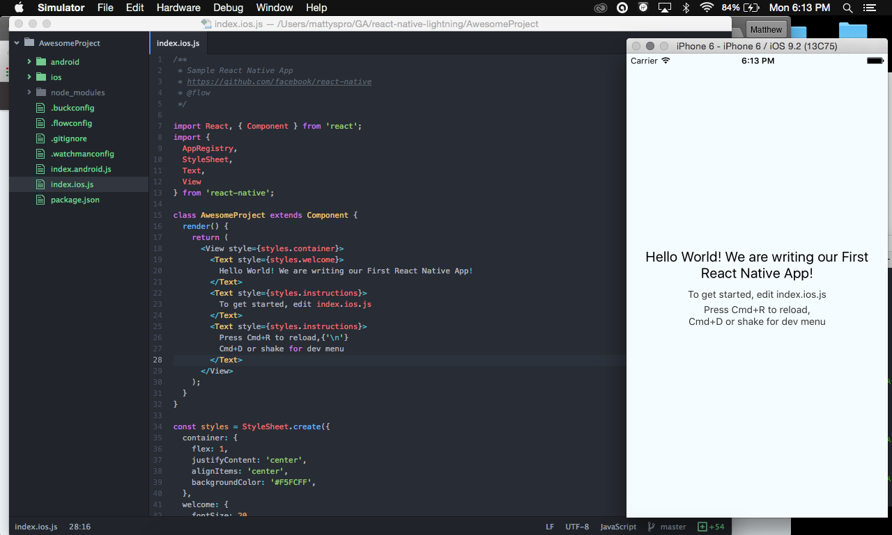
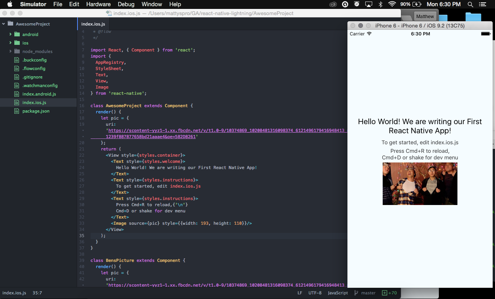

## React Native

* Allows for JavaScript to be core language 
* Makes changing / updating an app easier, one code base

## Picture 1

## Picture 2

## React Components
* Props => properties ex: [this.props.name]
* Uses let => comparable to variables
* Uses Flexbox for styling
* Fetch => Calling on external api
* list view and table view -> problem 

## Super Cool awsome demo... not really..

1. Lets get icons!
2. npm install react-native-vector-icons --save
3. Whats going to happen????
4. Adding dependencies with JavaScript!?!?! 
5. Well kind of...
6. Actually adding a library.. But you can add dependencies with our package.json! I dont have demo but saw a video and someone did it
7. Usually you would have to declare libraries in Xcode but now we have rnpm
8. lets run [rnpm link] in the console and see what happens
9. import Icon from 'react-native-vector-icons/FontAwesome' 

# react-native-demo
